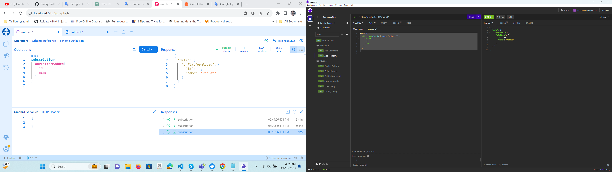

# Project Call API tree (Markdown Tree) ==> fulfill the requests
# ===Action(insert,delete,update,...)======Mutations=========
## Add Platform
        mutation {
            addPlatform(input: { name: "RedHat" }) {
                platform {
                    id
                    name
                }
            }
        }
## Add Command (***Note: Use on PostMan Or Browser***)
        mutation {
            addCommand(
                input: {
                    howTo: "Perform directory listing"
                    commanLine: "ls"
                    platformId: 3
                }
            ) {
                command {
                    id
                    howTo
                    commandLine
                    platform {
                        name
                    }
                }
            }
        }
# ===Action(Select,...)======Queries=========(***Note: Use on PostMan,Browser,Insomina,...***)
## Get platforms
        query {
            platform {
                id
                name
            }
        }
## Get Commands
        query {
            command {
                howTo
                commandLine
                platform {
                    name
                }
            }
        }
## Get Platforms and Commands
        query {
            platform {
                id
                name
                commands {
                    id
                    platformId
                    howTo
                    commandLine
                }
            }
        }
## Parallel Platforms
        query {
            a: platform {
                id
                name
            }
            b: platform {
                id
                name
            }
            c: platform {
                id
                name
            }
        }
## Filter Query
        query {
            command(where: { platformId: { eq: 1 } }) {
                id
                platform {
                    id
                    name
                }
                commandLine
                howTo
            }
        }
## Sorting Query
        query {
            platform(order: { name: ASC }) {
                name
            }
        }
## subscription (***Note: Just Used on Browser***)
        subscription {
            onPlatformAdded {
                id
                name
            }
        }

# Edit From Link : https://youtu.be/HuN94qNwQmM by 3Dola(DolaThanChuong 369)